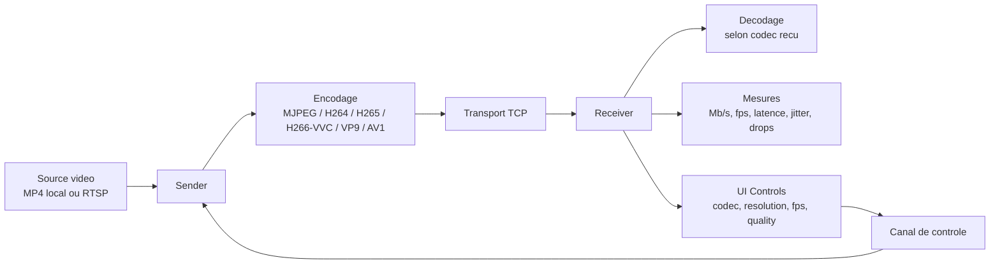

# Video Bandwidth

Ce projet simule un flux video temps reel entre un emetteur et un recepteur afin de mesurer le debit reseau observe de chaque cote.

Projet open source pour tester et comparer l'impact des codecs video sur le debit reseau, la latence et la stabilite du flux.

## Open Source

- Objectif: fournir un bench simple et reproductible pour comparer `mjpeg`, `h264`, `h265`, `h266/vvc`, `vp9`, `av1`.
- Statut: repository public.
- Licence: `MIT` (voir [LICENSE](LICENSE)).

## Principe

- L'emetteur lit une source video avec OpenCV.
- En developpement, la source par defaut est `cars-moving-on-road.mp4`.
- En production, la meme CLI peut lire une URL RTSP via `--source rtsp://...`.
- Le recepteur choisit le codec (`MJPEG`, `H264`, `H265`, `H266/VVC`, `VP9` ou `AV1`), puis l'emetteur encode et envoie les donnees via TCP.
- Le recepteur decode les frames, affiche la video en temps reel, mesure le debit recu et pilote les reglages du flux.
- Optionnellement, le recepteur peut activer un compteur de voitures (YOLO) avec ligne de comptage et affichage des boites de detection.

Le debit affiche est le debit applicatif, calcule a partir des octets effectivement envoyes/recus par le programme.

## Schema



## Installation

```bash
python -m pip install -r requirements.txt
```

## Lancer la demo locale

Dans un premier terminal:

```bash
python -m video_bandwidth.receiver --bind 127.0.0.1 --port 5000
```

Dans un second terminal:

```bash
python -m video_bandwidth.sender --host 127.0.0.1 --port 5000 --source cars-moving-on-road.mp4 --loop
```

Appuyer sur `q` dans la fenetre du recepteur pour arreter l'affichage.

Depuis la fenetre du recepteur, l'utilisateur peut modifier en direct:

- `FPS` (slider)
- `Quality` (slider)
- `Resolution` (dropdown) dans la fenetre `Receiver Controls`
- `Codec` (dropdown) dans la meme fenetre `Receiver Controls`
- `Compteur voitures (YOLO)` (case a cocher) dans la meme fenetre `Receiver Controls`
- Codecs disponibles: `mjpeg`, `h264`, `h265`, `h266`, `vp9`, `av1`
- Presets de resolution: `640x360`, `854x480`, `1280x720`, `1920x1080`

Ces valeurs sont envoyees au sender, qui adapte immediatement le flux qu'il produit.
Le compteur YOLO est applique localement cote recepteur (post-decodage) pour ne pas perturber la mesure du debit reseau transporte.

## Options utiles

```bash
python -m video_bandwidth.sender --help
python -m video_bandwidth.receiver --help
```

Exemples:

```bash
python -m video_bandwidth.sender --fps 25 --jpeg-quality 80 --resolution 1280x720 --codec h265
python -m video_bandwidth.sender --fps 25 --jpeg-quality 80 --resolution 1280x720 --codec h266
python -m video_bandwidth.sender --fps 25 --jpeg-quality 80 --resolution 1280x720 --codec vp9
python -m video_bandwidth.sender --fps 25 --jpeg-quality 80 --resolution 1280x720 --codec av1
python -m video_bandwidth.sender --source rtsp://camera.local:554/stream1
python -m video_bandwidth.receiver --no-display --control-fps 12 --control-quality 50 --control-resolution 640x360 --control-codec vp9
python -m video_bandwidth.receiver --no-display --control-fps 12 --control-quality 50 --control-resolution 640x360 --control-codec av1
python -m video_bandwidth.receiver --bind 127.0.0.1 --port 5000 --enable-car-counter --yolo-model yolov8n.pt
```

## Mesures affichees

- `Mb/s`: debit moyen sur la derniere seconde.
- `fps`: cadence de frames observee sur la derniere seconde.
- `MB`: volume cumule depuis le debut du stream.
- `Latence (ms)`: latence moyenne bout-en-bout estimee.
- `Jitter (ms)`: variation de latence (lissage type RTP).
- `Drops (%)`: frames perdues/indecodables estimees.
- `Voitures comptees`: total des voitures ayant traverse la ligne de comptage (haut -> bas).
- `Detections YOLO`: nombre de detections courantes sur la frame.

Quand le codec recu change (`MJPEG` -> `H264`, etc.), les indicateurs sont remis a zero automatiquement pour comparer proprement les codecs.

## Limites

- Le protocole est volontairement simple: un seul flux TCP, payload annote avec son codec.
- Le controle est initie depuis le recepteur, mais c'est bien l'emetteur qui applique les reglages.
- Le debit mesure est celui du flux compresse envoye au recepteur, pas le bitrate du fichier source d'origine.
- Si le FPS demande est inferieur au FPS source, l'emetteur supprime des frames pour garder une vitesse video coherente.
- Si le FPS demande est superieur au FPS source, l'emetteur reste limite par la cadence de la source.
- En cas de reseau lent, le flux ralentira naturellement car TCP garantit la livraison et l'ordre.
- La disponibilite reelle de `h265`, `h266`, `vp9` et `av1` depend des encodeurs/decoders presents dans la build FFmpeg/PyAV locale.
- Pour `h266`, il faut au minimum un encodeur VVC cote emetteur (souvent `libvvenc`). Cote recepteur, le decodeur peut etre `libvvdec` ou `vvc` natif selon la build FFmpeg.
- Le compteur voitures utilise `ultralytics` + un modele YOLO (par defaut `yolov8n.pt`) et peut etre plus couteux en CPU/GPU.

## Contribuer

Les contributions sont bienvenues: issues, idees de metriques, nouveaux codecs, optimisations encode/decode, et scenarios de test.

## Licence

Ce projet est distribue sous licence MIT. Voir [LICENSE](LICENSE).
